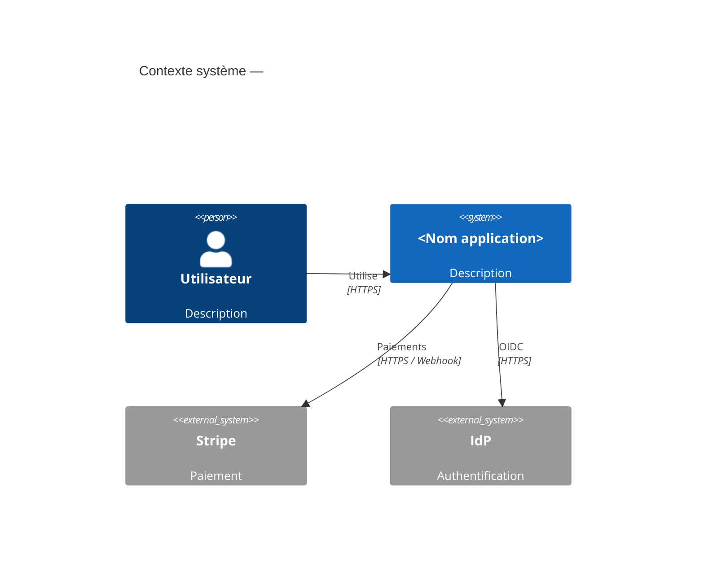
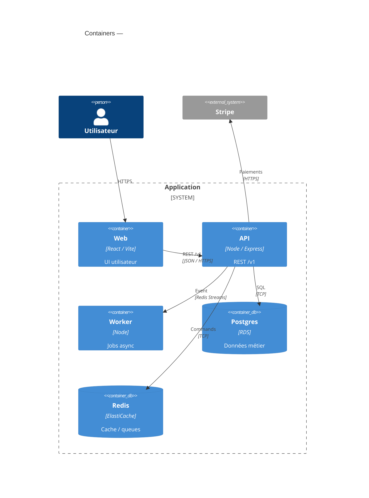
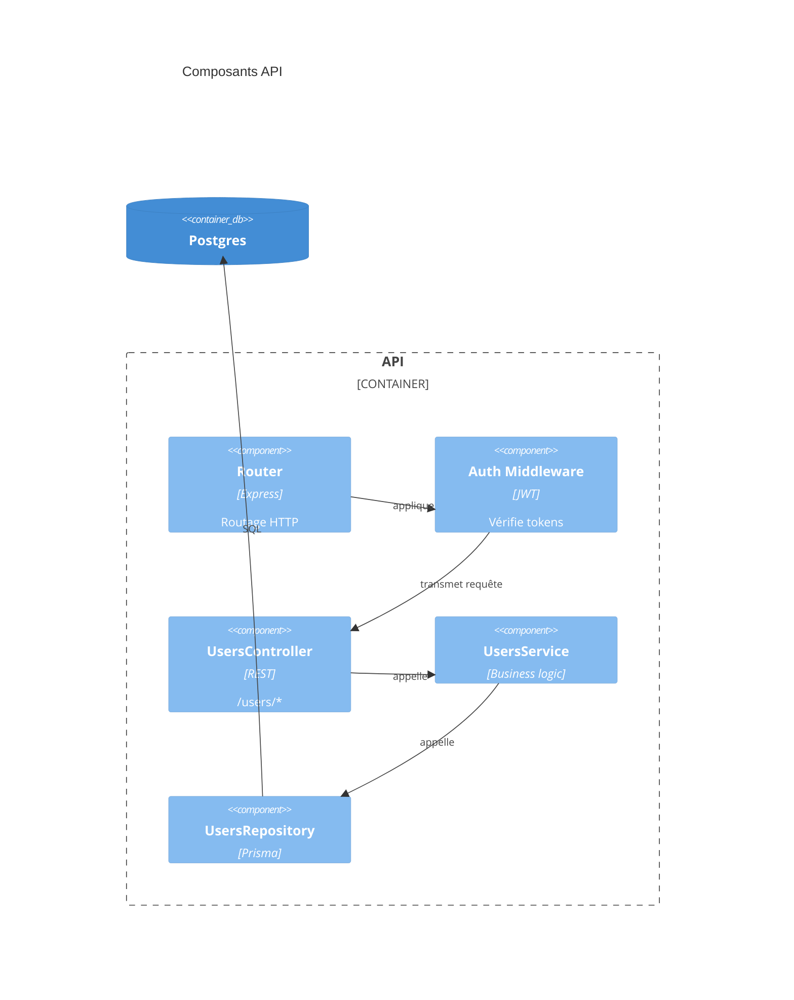
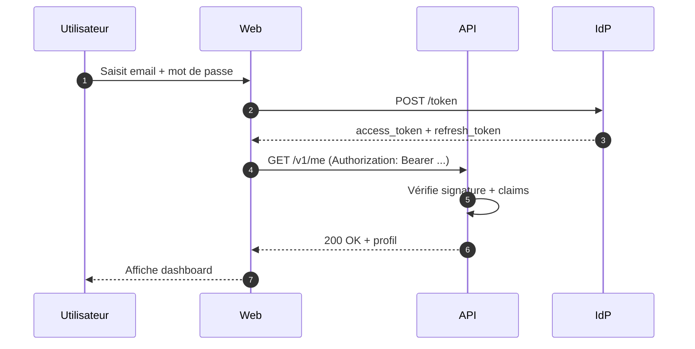
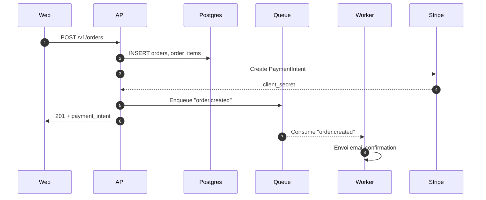
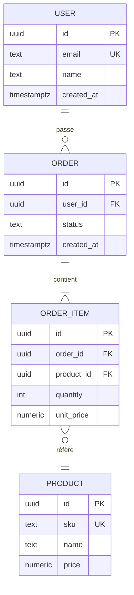
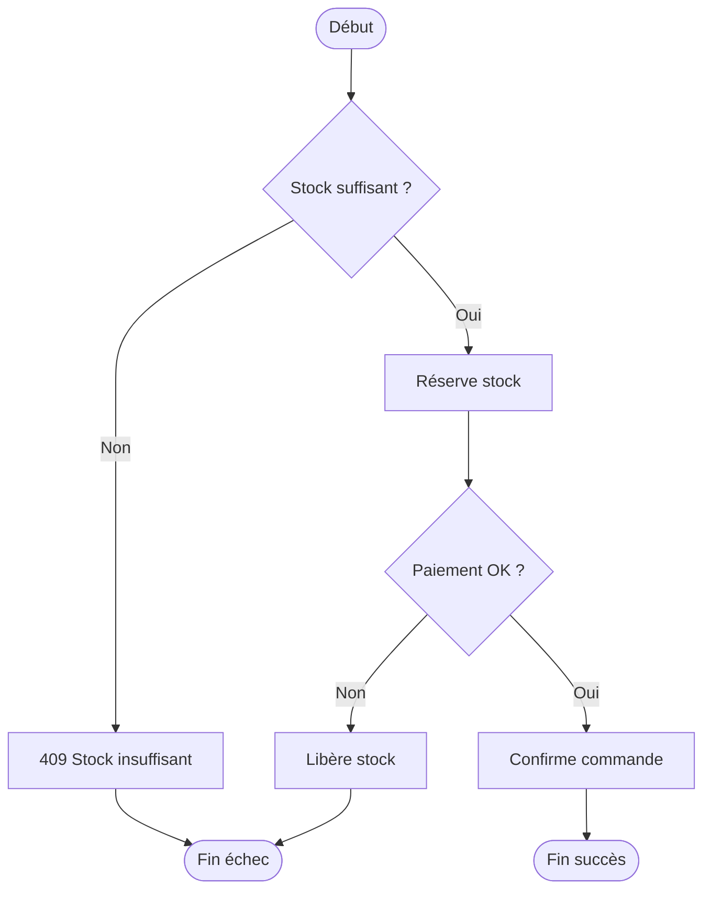

# Mermaid Templates FR

## 1. C4 — Context

## 2. C4 — Container

## 3. C4 — Component (zoom sur l'API)

## 4. Séquence — Flow d'authentification

## 5. Séquence — Flow de création de commande

## 6. ERD

## 7. Flowchart — Algorithme métier

