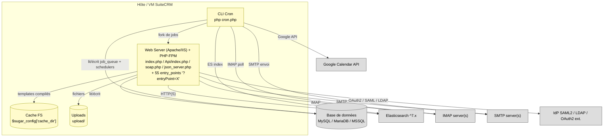
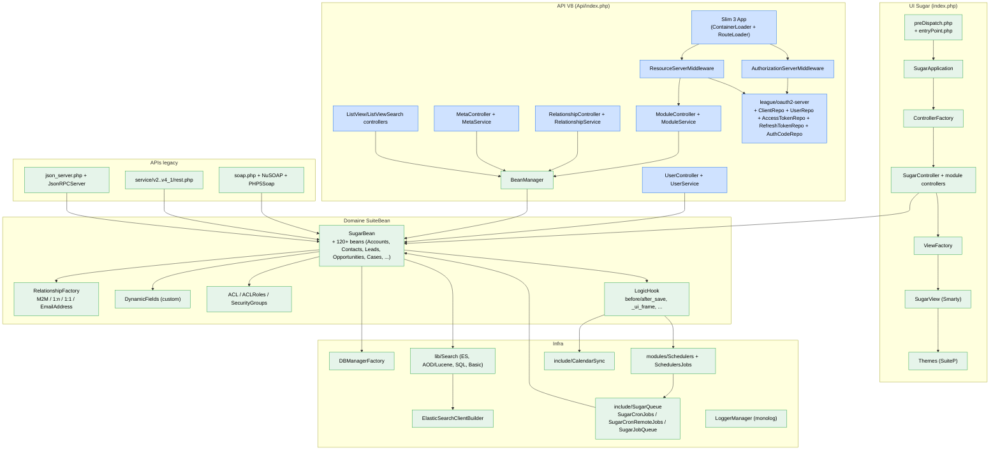

# Diagrammes C4 — SuiteCRM 7.15.1

> Diagrammes Mermaid (Context / Container / Component). Tout élément est traçable au code ([inventaire](../architecture/00_inventaire.md), [dépendances](../architecture/01_dependances.md)).

## 1. Niveau 1 — Contexte

```mermaid
flowchart LR
    classDef user fill:#cce5ff,stroke:#1f6feb,color:#000;
    classDef sys fill:#fffbcc,stroke:#999900,color:#000;
    classDef ext fill:#ddd,stroke:#555,color:#000;

    EndUser["Utilisateur final<br/>(commercial / support / admin)"]:::user
    ApiClient["Client API<br/>(mobile / intégrateur)"]:::user
    Anonymous["Visiteur anonyme<br/>(formulaires Web-to-Lead, trackers)"]:::user

    SuiteCRM["<b>SuiteCRM 7.15.1</b><br/>UI Smarty + API V8 + APIs legacy + Cron<br/>(PHP 8.1+ monolithe)"]:::sys

    IdP["Identity Provider<br/>(SAML2 / LDAP / OAuth2 ext.)"]:::ext
    IMAP["Serveur IMAP<br/>(mails entrants)"]:::ext
    SMTP["Serveur SMTP<br/>(mails sortants)"]:::ext
    GCal["Google Calendar API"]:::ext
    ES["Cluster Elasticsearch ^7.x"]:::ext
    DB[("MySQL / MariaDB / MSSQL")]:::ext
    FS[("Stockage fichiers<br/>upload/ + cache/")]:::ext

    EndUser -->|HTTP(S) UI| SuiteCRM
    ApiClient -->|HTTPS REST JSON:API<br/>OAuth2 Bearer| SuiteCRM
    Anonymous -->|HTTP form / tracker| SuiteCRM

    SuiteCRM <-->|SAML 2.0 / LDAP / OAuth2 ext.| IdP
    SuiteCRM -->|IMAP / IMAPS| IMAP
    SuiteCRM -->|SMTP / TLS| SMTP
    SuiteCRM -->|HTTPS (google/apiclient)| GCal
    SuiteCRM -->|HTTP(S) ES API| ES
    SuiteCRM --- DB
    SuiteCRM --- FS
```

Sources :
- IdP : [api/authentification.md](../api/authentification.md), [composer.json:57](../../SuiteCRM/composer.json#L57)
- IMAP/SMTP : [composer.json:50, 58](../../SuiteCRM/composer.json#L50-L58)
- Google Calendar : [composer.json:46](../../SuiteCRM/composer.json#L46)
- Elasticsearch : [composer.json:44](../../SuiteCRM/composer.json#L44)
- DB : [include/database/DBManagerFactory.php:60-126](../../SuiteCRM/include/database/DBManagerFactory.php#L60-L126)

## 2. Niveau 2 — Conteneurs



Preuves :
- Web server : `index.php` ([index.php:41-52](../../SuiteCRM/index.php#L41-L52)), `Api/index.php` ([Api/index.php:1-5](../../SuiteCRM/Api/index.php#L1-L5)), `soap.php` ([soap.php:50-67](../../SuiteCRM/soap.php#L50-L67)), `json_server.php` ([json_server.php:46-48](../../SuiteCRM/json_server.php#L46-L48)).
- Entry-points : [entry_point_registry.php](../../SuiteCRM/include/MVC/Controller/entry_point_registry.php) (55 entries).
- Cron : `cron.php` ([cron.php:48-110](../../SuiteCRM/cron.php#L48-L110)).

## 3. Niveau 3 — Composants du conteneur Web



Preuves clés (extraits) :

- `SugarApplication::execute` → [include/MVC/SugarApplication.php:74-103](../../SuiteCRM/include/MVC/SugarApplication.php#L74-L103).
- `Slim\App + RouteLoader` → [Api/Core/app.php:23-26](../../SuiteCRM/Api/Core/app.php#L23-L26).
- Middlewares OAuth2 → [Api/V8/Config/services/middlewares.php:13-111](../../SuiteCRM/Api/V8/Config/services/middlewares.php#L13-L111).
- `ModuleController/Service/BeanManager` → [Api/V8/Controller/ModuleController.php](../../SuiteCRM/Api/V8/Controller/ModuleController.php), [Api/V8/Service/ModuleService.php](../../SuiteCRM/Api/V8/Service/ModuleService.php), [Api/V8/Config/services.php:13-18](../../SuiteCRM/Api/V8/Config/services.php#L13-L18).
- `RelationshipFactory` → [data/Relationships/RelationshipFactory.php](../../SuiteCRM/data/Relationships/RelationshipFactory.php).
- `DBManagerFactory` → [include/database/DBManagerFactory.php:60-159](../../SuiteCRM/include/database/DBManagerFactory.php#L60-L159).
- `Schedulers + SugarQueue` → [modules/Schedulers/Scheduler.php:84, 196](../../SuiteCRM/modules/Schedulers/Scheduler.php#L84-L196), [include/SugarQueue/](../../SuiteCRM/include/SugarQueue/).
