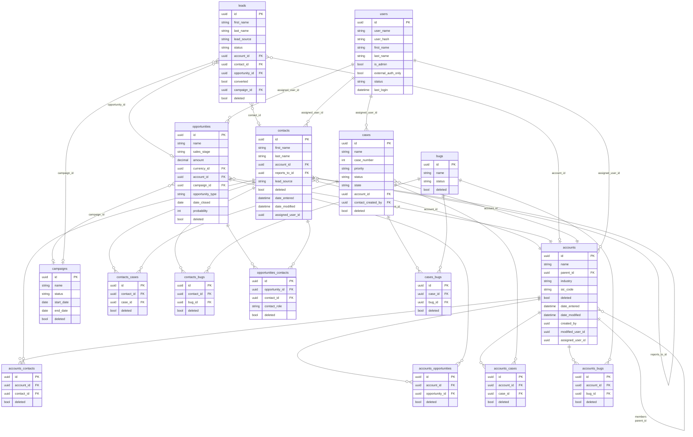
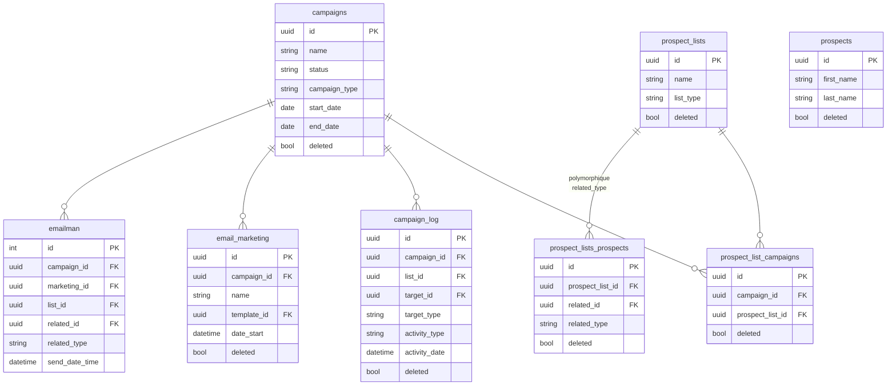
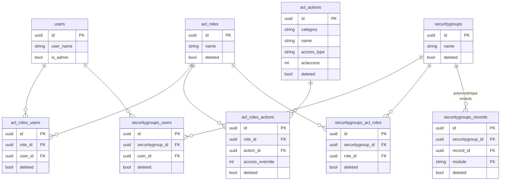
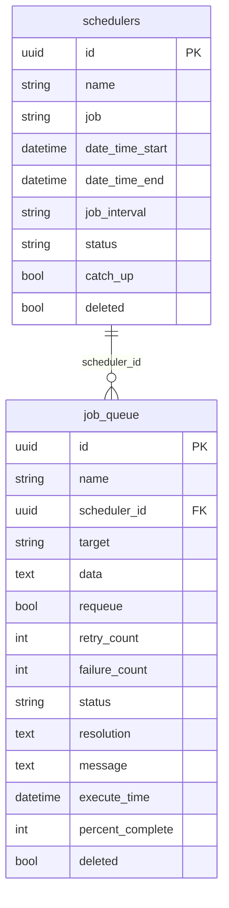
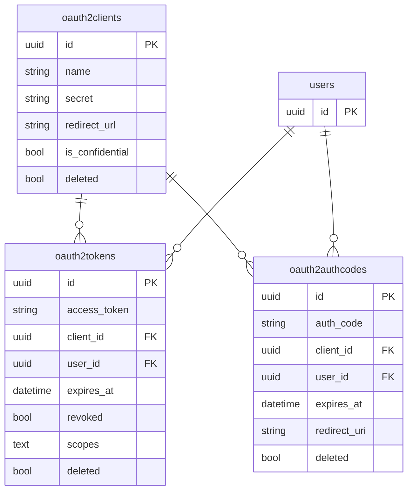

# Diagramme ERD — Sous-ensemble CRM core

> Le schéma complet (~100 tables) n'est pas représenté ici — il est dérivé des vardefs/metadata (voir [data/modele_donnees.md](../data/modele_donnees.md)). Le diagramme suivant montre le **cœur CRM** prouvé.

## 1. CRM core

Preuves :

- `accounts` vardefs : [modules/Accounts/vardefs.php:45-200](../../SuiteCRM/modules/Accounts/vardefs.php#L45-L200)
- `contacts` vardefs : [modules/Contacts/vardefs.php:44-200](../../SuiteCRM/modules/Contacts/vardefs.php#L44-L200)
- `opportunities` vardefs : [modules/Opportunities/vardefs.php:45-200](../../SuiteCRM/modules/Opportunities/vardefs.php#L45-L200)
- `cases` vardefs : [modules/Cases/vardefs.php:46-220](../../SuiteCRM/modules/Cases/vardefs.php#L46-L220)
- M2M `accounts_contacts` : [metadata/accounts_contactsMetaData.php:44-62](../../SuiteCRM/metadata/accounts_contactsMetaData.php#L44-L62)
- M2M `accounts_opportunities` : [metadata/accounts_opportunitiesMetaData.php:44-62](../../SuiteCRM/metadata/accounts_opportunitiesMetaData.php#L44-L62)
- M2M `accounts_cases` : [metadata/accounts_casesMetaData.php](../../SuiteCRM/metadata/accounts_casesMetaData.php)
- M2M `accounts_bugs` : [metadata/accounts_bugsMetaData.php:60](../../SuiteCRM/metadata/accounts_bugsMetaData.php#L60)
- M2M `cases_bugs` : [metadata/cases_bugsMetaData.php](../../SuiteCRM/metadata/cases_bugsMetaData.php)

## 2. Marketing

Preuves : [metadata/prospect_list_campaignsMetaData.php](../../SuiteCRM/metadata/prospect_list_campaignsMetaData.php), [metadata/prospect_lists_prospectsMetaData.php](../../SuiteCRM/metadata/prospect_lists_prospectsMetaData.php), [modules/CampaignLog/](../../SuiteCRM/modules/CampaignLog/), [modules/EmailMarketing/](../../SuiteCRM/modules/EmailMarketing/), [modules/EmailMan/](../../SuiteCRM/modules/EmailMan/).

## 3. ACL & Security

Preuves : [metadata/acl_roles_actionsMetaData.php:99](../../SuiteCRM/metadata/acl_roles_actionsMetaData.php#L99), [metadata/acl_roles_usersMetaData.php:93](../../SuiteCRM/metadata/acl_roles_usersMetaData.php#L93), [metadata/securitygroups_usersMetaData.php](../../SuiteCRM/metadata/securitygroups_usersMetaData.php), [metadata/securitygroups_recordsMetaData.php](../../SuiteCRM/metadata/securitygroups_recordsMetaData.php).

## 4. Scheduler / jobs

Preuves : [modules/Schedulers/Scheduler.php:84, 196](../../SuiteCRM/modules/Schedulers/Scheduler.php#L84-L196), [modules/SchedulersJobs/SchedulersJob.php](../../SuiteCRM/modules/SchedulersJobs/SchedulersJob.php).

## 5. OAuth2 (API V8)

Preuves : [Api/V8/OAuth2/Repository/](../../SuiteCRM/Api/V8/OAuth2/Repository/), modules [modules/OAuth2Clients/](../../SuiteCRM/modules/OAuth2Clients/), [modules/OAuth2Tokens/](../../SuiteCRM/modules/OAuth2Tokens/), [modules/OAuth2AuthCodes/](../../SuiteCRM/modules/OAuth2AuthCodes/).

> ⚠️ Les colonnes précises des tables OAuth2 sont déclarées dans les vardefs des modules ; les types ci-dessus représentent les conventions Sugar et la structure attendue par `league/oauth2-server`. INCONNU : champ par champ exhaustif sans dérouler chaque `<module>/vardefs.php` du sous-dossier OAuth2.
