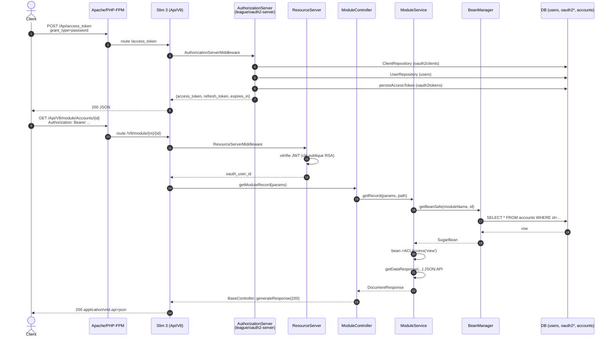
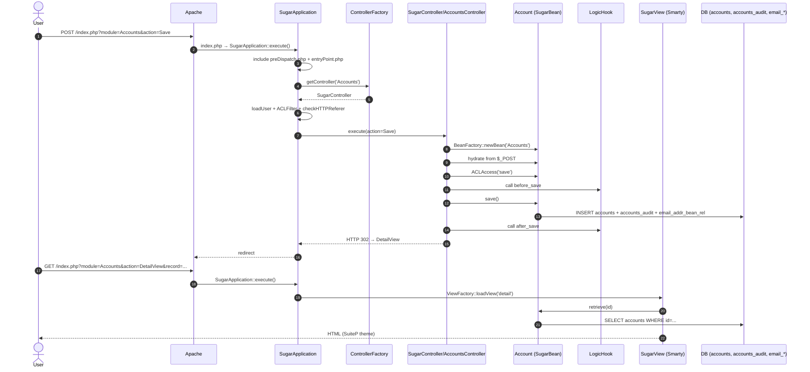
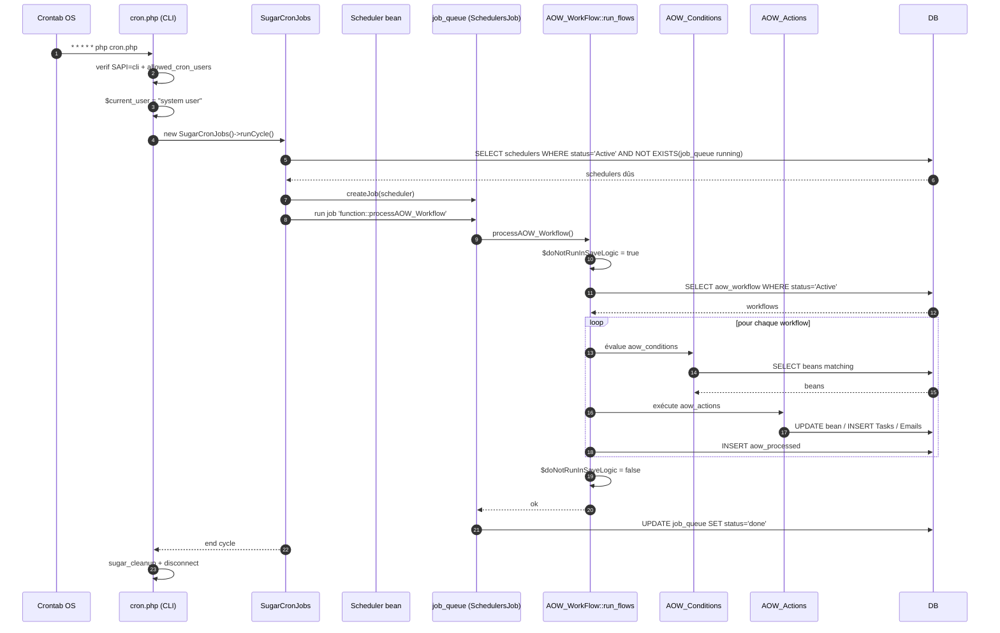

# Diagrammes de séquence (Mermaid)

> Trois flows prouvés bout-en-bout. Pour les détails et preuves, voir [flows/](../flows/).

## 1. Login + lecture d'un Account via API V8 (OAuth2 password)

Preuves :

- Routes : [Api/V8/Config/routes.php:16-18, 62-64, 131](../../SuiteCRM/Api/V8/Config/routes.php#L16-L131)
- Middlewares OAuth2 : [Api/V8/Config/services/middlewares.php:39-111](../../SuiteCRM/Api/V8/Config/services/middlewares.php#L39-L111)
- Controller/Service : [Api/V8/Controller/ModuleController.php:36-43](../../SuiteCRM/Api/V8/Controller/ModuleController.php#L36-L43), [Api/V8/Service/ModuleService.php:74-92](../../SuiteCRM/Api/V8/Service/ModuleService.php#L74-L92)
- Réponse : [Api/V8/Controller/BaseController.php:19-34](../../SuiteCRM/Api/V8/Controller/BaseController.php#L19-L34)

## 2. Création d'un Account via l'UI Sugar

Preuves :

- Dispatch UI : [include/MVC/SugarApplication.php:74-103](../../SuiteCRM/include/MVC/SugarApplication.php#L74-L103)
- Logic hooks : [include/utils/LogicHook.php:44-50, 150-154](../../SuiteCRM/include/utils/LogicHook.php#L44-L154)
- Audit : [modules/Accounts/vardefs.php:47](../../SuiteCRM/modules/Accounts/vardefs.php#L47)

## 3. Cron → Workflow AOW → DB

Preuves :

- `cron.php` : [cron.php:48-110](../../SuiteCRM/cron.php#L48-L110)
- Scheduler driver : [include/SugarQueue/SugarCronJobs.php](../../SuiteCRM/include/SugarQueue/SugarCronJobs.php), [include/SugarQueue/SugarJobQueue.php](../../SuiteCRM/include/SugarQueue/SugarJobQueue.php)
- `processAOW_Workflow` & garde anti-cascade : [modules/AOW_WorkFlow/AOW_WorkFlow.php:108-232](../../SuiteCRM/modules/AOW_WorkFlow/AOW_WorkFlow.php#L108-L232)
- Sélection des schedulers dûs : [modules/Schedulers/Scheduler.php:196](../../SuiteCRM/modules/Schedulers/Scheduler.php#L196)
